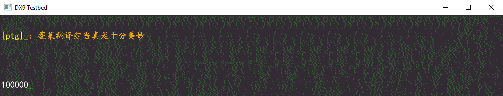

This is a sample project that makes use of Supermouse's Gujian MOD SDK.

Prerequisites: 
 - Microsoft Visual Studio (I used 2017)
 - Microsoft DirectX SDK (June 2010)

Build notes:
 - Update the VC++ include and library directories (Project -> Properties -> VC++ Directories)
 - Add "d3d9x.lib" to (Project -> Properties -> Linker -> Input -> Additional Dependencies)
 - Update the path to the DEF file at: (Project -> Properties -> Linker -> Input -> Module Definition File)

Update Log:
- 2018-06-03: Figuring out how to set the "DEF File" and using the MOD SDK's header file
- 2018-06-10: Hooking the IDirect3DDevice9::Present method
- 2018-08-21: Testbed for running the DLL without having to start the game

(:
